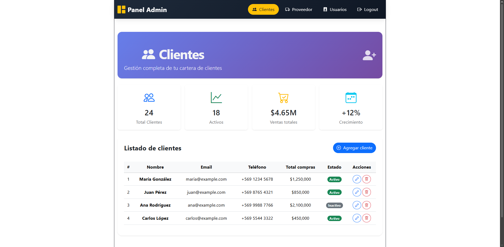

# Panel Administrativo con React + Vite

Panel administrativo moderno desarrollado con React, Vite y React Router. Incluye navegación sin recarga, vistas para Clientes, Proveedores, Usuarios y Logout, con estilos basados en Bootstrap 5 y personalizaciones con soporte para modo oscuro/claro.

## Captura de pantalla



## Tecnologías utilizadas

- **React 18** – Biblioteca para interfaces de usuario
- **Vite** – Entorno de desarrollo rápido
- **React Router DOM** – Enrutamiento y navegación SPA
- **Bootstrap 5** – Framework de estilos (navbar, tarjetas, tablas, botones)
- **Bootstrap Icons** – Iconografía
- **CSS personalizado** – Variables CSS, modo oscuro automático, diseño centrado

## Características

- Barra de navegación fija con logo, enlaces y efecto activo.
- Rutas configurables con `<BrowserRouter>`, `<Routes>` y `<NavLink>`.
- Vistas:
  - **Clientes**: tarjetas de resumen (totales, activos, ventas) y tabla de clientes con datos simulados.
  - **Proveedor**: tarjetas con información de cada proveedor.
  - **Usuarios**: tabla con roles, último acceso y estado.
  - **Logout**: mensaje de cierre de sesión con opción para reiniciar.
- Diseño responsive, sombras y efectos hover.
- Modo oscuro automático según la preferencia del sistema operativo.
- Footer institucional.

## Instalación y ejecución

Sigue estos pasos para levantar el proyecto en tu máquina local.

1. Clona el repositorio:
   ```bash
   git clone https://github.com/Estebann8312/panel-administrativo-final.git
   cd panel-administrativo-final
